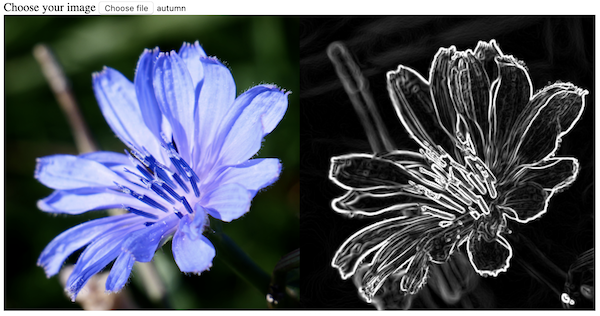
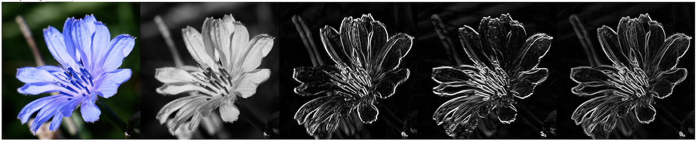
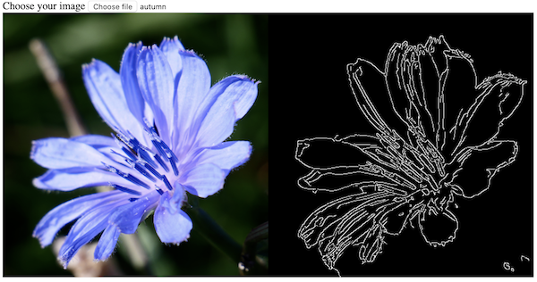

# Edge Detection 

Edge detection is a very useful and important task in the computer vision.

## 1. Sobel Operation

Sobel operation is used to find the changes (discontinuities, gradient) in the pixel values of e.g. a grayscale image, so to detect the edges.  



### a. preparations and convert the color image to a gray one

```javascript
let imgElement = document.getElementById("imageSrc");
let src = cv.imread(imgElement);
let dstx = new cv.Mat(); // represents the horizontal changes
let dsty = new cv.Mat(); // represents the vertical changes
let dst = new cv.Mat(); // merges above 2 changes
// convert to gray image
cv.cvtColor(src, src, cv.COLOR_RGB2GRAY, 0);
```

### b. using the filter  to get the horizontal changes in the image

```javascript
// sobel operation on the x-axis
cv.Sobel(src, dstx, cv.CV_16S, 1, 0, 3, 1, 0, cv.BORDER_DEFAULT);
```

### c. using the filter  to get the vertical changes in the image

```javascript
// sobel operation on the y-axis
cv.Sobel(src, dsty, cv.CV_16S, 0, 1, 3, 1, 0, cv.BORDER_DEFAULT);
```

### d. merge the horizontal and vertical changes (gradient) and show the final results

```javascript
// take the absolute values and convert them back to cv.CV_8U
cv.convertScaleAbs(dstx, dstx, 1, 0); 
cv.convertScaleAbs(dsty, dsty, 1, 0);
// merge the images
cv.addWeighted(dstx, 0.5, dsty, 0.5, 0, dst);
// show the result and release objects
cv.imshow("canvasOutput", dst);
src.delete(); dstx.delete(); dsty.delete(); dst.delete();
```

This image series is showing the steps, from a) converting to gray image, b) getting horizontal changes in the gray image, c) getting vertical changes, and d) the final merged images:



### d'. calculate gradient magnitude

Instead of calculating the average of the horizontal and vertical changes, as in the step d, replace it with calculating their magnitude to get more precise results.

```javascript
// calculate the magnitude of the 2 images
cv.magnitude(dstx, dsty, dst);
// set back to cv.CV_8U space
cv.convertScaleAbs(dst, dst, 1, 0);
// show the result and release objects
cv.imshow("canvasOutput", dst);
src.delete(); dstx.delete(); dsty.delete(); dst.delete();
```

## 2. Canny Operation

After **finding the gradient** of the image, e.g. based on sobel operation, **Canny** edge detection uses further techniques to remove noises and extract the strong edges from  the weak ones:



The further techniques include:
* **noise reduction** with gaussian filter, which can be applied before sobel operation;
* **non-maximum suppression** - the weaker gradients in the same direction will be suppressed, only the strongest one persists;
* **hysteresis thresholding** - 2 threshold values are applied: 
   * the lower one is to block further weaker gradients, the higher one is to persist the stronger ones which are considered as edges; 
   * the gradients in-between can only survive if they are connected to the strong edges which have survived the higher threshold value.


