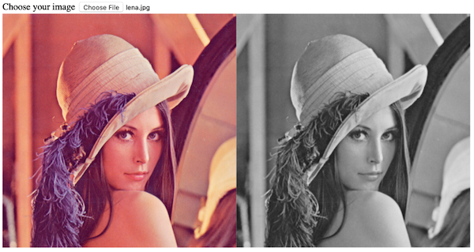

# opencv.js

Using opencv.js to process images in the web applications

## 1. load opencv.js file

```html
<script async src="https://docs.opencv.org/3.4.5/opencv.js" onload="onOpencvJSLoaded();" type="text/javascript"></script>
```
## 2. convert color image to gray image



```javascript
  let imgElement = document.getElementById("imageSrc");
  let src = cv.imread(imgElement);
  let dst = new cv.Mat();
  cv.cvtColor(src, dst, cv.COLOR_RGBA2GRAY);
  cv.imshow("canvasOutput", dst);
  src.delete();
  dst.delete();
```

