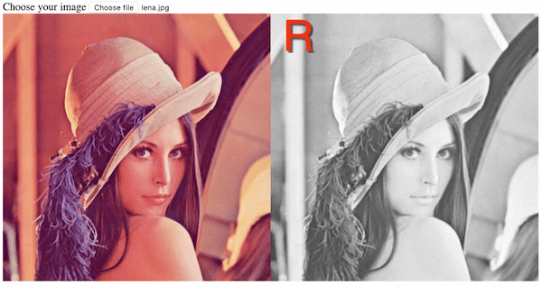
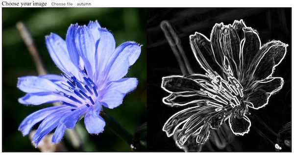

# opencv.js

Using opencv.js to process images in the web applications

## 1. load opencv.js file

```html
<script async src="https://docs.opencv.org/3.4.5/opencv.js" onload="onOpencvJSLoaded();" type="text/javascript"></script>
```

If you want to speed up the loading process, you'd better to store the opencv.js library in your local repository.

## 2. basic color image conversion

### a. convert color image to gray image


```javascript
let imgElement = document.getElementById("imageSrc");
let src = cv.imread(imgElement);
let dst = new cv.Mat();
cv.cvtColor(src, dst, cv.COLOR_RGBA2GRAY);
cv.imshow("canvasOutput", dst);
src.delete();
dst.delete();
```

### b. extract RGB channels

You can extract the R (red), G (green), B (blue) channels from the original color image.



```javascript
let imgElement = document.getElementById("imageSrc");
let src = cv.imread(imgElement);
let R = new cv.Mat();

// extract channels
let rgbaPlanes = new cv.MatVector();
// split the Mat
cv.split(src, rgbaPlanes);
// get RED channel
R = rgbaPlanes.get(0);
cv.imshow("canvasOutput", R);

// release objects
src.delete();
rgbaPlanes.delete();
R.delete();
```

### c. convert to different color spaces, AND extract channels

You can convert the color image from the original RGB color space to CIE L\*a\*b\* color space, extract the L channel to get the perceptual lightness of the image.

```javascript
let imgElement = document.getElementById("imageSrc");
let src = cv.imread(imgElement);
let dst = new cv.Mat();

// convert the color image into the Lab space
cv.cvtColor(src, src, cv.COLOR_RGBA2RGB);
cv.cvtColor(src, dst, cv.COLOR_RGB2Lab);

// extract the Lightness channel
let labPlanes = new cv.MatVector();
// split the Mat
cv.split(dst, labPlanes);
// get L channel
let L = labPlanes.get(0);
cv.imshow("canvasOutput", L);

// release objects
src.delete();
labPlanes.delete();
L.delete();
dst.delete();
```

## 3. smooth image 

### a. via median filter

The <b>Median Filter</b> is used to remove the noise and make the image smooth.


```javascript
let imgElement = document.getElementById("imageSrc");
let src = cv.imread(imgElement);
let dst = new cv.Mat();
cv.medianBlur(src, dst, 5);
cv.imshow("canvasOutput", dst);
src.delete();
dst.delete();
```

### b. via box filter

The <b>Box Filter</b> is to replace the central element of the kernal area with the average of all the pixels under this area, so the image will get blurred.

```javascript
let imgElement = document.getElementById("imageSrc");
let src = cv.imread(imgElement);
let dst = new cv.Mat();
let ksize = new cv.Size(5, 5);
let anchor = new cv.Point(-1, -1); // Point (-1, -1) means that anchor is at the kernel center
cv.boxFilter(src, dst, -1, ksize, anchor, true, cv.BORDER_DEFAULT); // -1 to use src.depth()
cv.imshow("canvasOutput", dst);
src.delete();
dst.delete();
```

## 4. edge detection with sobel operation



Sobel operation is used to find the changes (discontinuities, gradient) of the pixel values in e.g. a grayscale image, so to detect the edges. 

### a. preparations and convert the color image to a gray one

```javascript
let imgElement = document.getElementById("imageSrc");
let src = cv.imread(imgElement);
let dstx = new cv.Mat(); // represents the horizontal changes
let dsty = new cv.Mat(); // represents the vertical changes
let dst = new cv.Mat(); // merges above 2 changes
// convert to gray image
cv.cvtColor(src, src, cv.COLOR_RGB2GRAY, 0);
```

### b. using the filter  to get the horizontal changes in the image

```javascript
// sobel operation on the x-axis
cv.Sobel(src, dstx, cv.CV_16S, 1, 0, 3, 1, 0, cv.BORDER_DEFAULT);
```

### c. using the filter  to get the vertical changes in the image

```javascript
// sobel operation on the y-axis
cv.Sobel(src, dsty, cv.CV_16S, 0, 1, 3, 1, 0, cv.BORDER_DEFAULT);
```

### d. merge the horizontal and vertical changes (gradient) and show the final results

```javascript
// take the absolute values and convert them back to cv.CV_8U
cv.convertScaleAbs(dstx, dstx, 1, 0); 
cv.convertScaleAbs(dsty, dsty, 1, 0);
// merge the images
cv.addWeighted(dstx, 0.5, dsty, 0.5, 0, dst);
// show the result and release objects
cv.imshow("canvasOutput", dst);
src.delete(); dstx.delete(); dsty.delete(); dst.delete();
```

This image series is showing the steps, from a) converting to gray image, b) getting horizontal changes in the gray image, c) getting vertical changes, and d) the final merged images:


### d'. calculate gradient magnitude

Instead of calculating the average of the horizontal and vertical changes, as in the step d, replace it with calculating their magnitude to get more precise results.

```javascript
// calculate the magnitude of the 2 images
cv.magnitude(dstx, dsty, dst);
// set back to cv.CV_8U space
cv.convertScaleAbs(dst, dst, 1, 0);
// show the result and release objects
cv.imshow("canvasOutput", dst);
src.delete(); dstx.delete(); dsty.delete(); dst.delete();
```